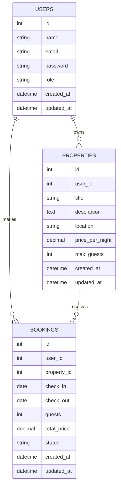

# BabiHost ERD Diagram

```mermaid
erDiagram
    USERS ||--o{ PROPERTIES : owns
    USERS ||--o{ BOOKINGS : makes
    PROPERTIES ||--o{ BOOKINGS : receives

    USERS {
        int id
        string name
        string email
        string password
        string role
        datetime created_at
        datetime updated_at
    }

    PROPERTIES {
        int id
        int user_id
        string title
        text description
        string location
        decimal price_per_night
        int max_guests
        datetime created_at
        datetime updated_at
    }

    BOOKINGS {
        int id
        int user_id
        int property_id
        date check_in
        date check_out
        int guests
        decimal total_price
        string status
        datetime created_at
        datetime updated_at
    }
```